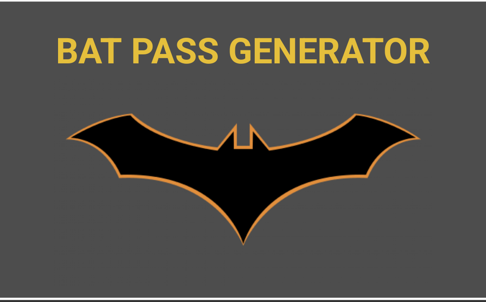
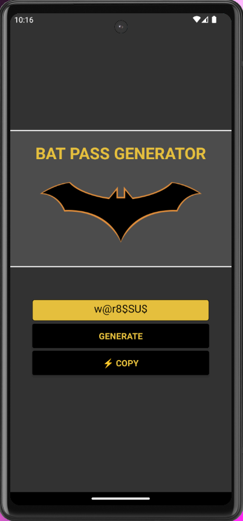

<div align="center">
  <a href="#">
    
  </a>
  <h1>Um aplicativo para gerar senhas fortes.</h1>  
</div>

## Pré-vizualização

<div align="center">
  <a href="#">
      
  </a>
</div>

## 🔥 Características
- [x] Gerar uma senha forte aleatória.
- [x] Copiar a senha para a sua área de transferência;

## 🖥 Tecnologias

Este projeto foi desenvolvido com as seguintes tecnologias:

-   [React Native](https://reactnative.dev/)
-   [Expo](https://docs.expo.dev/)

## 🛠 Construção
Você precisará do [Node.js](https://nodejs.org) instalado em seu computador para construir este aplicativo.

```bash
  git clone https://github.com/Carvalho-TJ/bat-pass-app.git
  $ cd bat-pass-app
  $ npm install
```

## ✅ Como executar o projeto
🔧 Execute o script
```bash
  $ npm run start
```
Executa o aplicativo no modo de desenvolvimento.

## Tiago R Carvalho 🐱‍👤👨‍💻

[](https://www.linkedin.com/in/tiago-r-carvalho-82471822a/)
